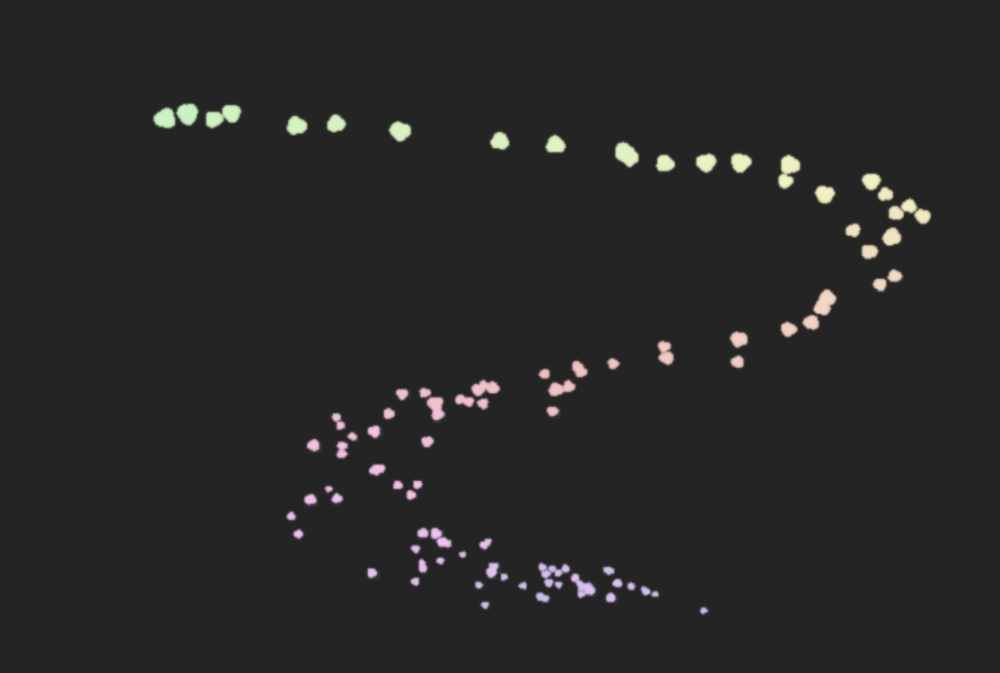

### 简介

一个模拟AE的Stardust插件的库, 基于PixiJS(>=5.0)和PixiJs Filters(可选, >=3.0), 并定义了粒子类, 四个发射器类(
区域发射器, 辅助发射器, 事件发射器, 复制型发射器)和粒子APP类

并提供了部分常用的动画曲线函数, 粒子干扰函数和实用类

``./examples``下有部分使用例子

#### 效果

**烟花**: 使用了滤镜, 路径湍流, 辅助粒子...


**移动粒子**: 使用了事件发射器, 重力模拟, 随时间变化的色相...



**精灵粒子**: 使用了粒子复制, 辅助粒子...


**下雪**: 使用了Sprite, 粒子排斥...


##### 粒子类(Particle)

粒子可以是Sprite(加载的图片), 也可以是图案(目前支持圆形(circle), 正方形(square), 凸多边形(polyfill), 多角形(polygon))

粒子基本属性:

- color: 颜色
- size: 大小
- life: 生命长度(毫秒)
- position: 位置, 有x, y
- scale: 放缩, 有x, y
- opacity: 不透明度
- speed: 速度大小
- direction: 速度方向, 弧度制
- zIndex: 图层, 越大越在上面
- rotation: 旋转角度, 弧度制
- rotationSpeed: 旋转速度, 弧度制
- blendMode: 叠加方式
- mask: 遮罩, 只能为图形, 不能为sprite
- filters: 滤镜, 与PixiJs的滤镜一样

基础图案参数如下:

- 圆形circle: {type: "circle", size: 半径}
- 正方形square: {type: "square", size: 边长}
- 多边形polyfill: {type: "polyfill", points: 顶点数, size: 多边形半径, curveFactor: 边的弧线程度}
- 多角形polygon: {type: "polygon", points: 顶点数, size: 大小, innerRadius: 内半径比size, oyerRadius: 外半径比size, curveFactor: 边的弧线程度}
- 云朵cloud: {type: "cloud", size: 云朵大小}

##### 粒子APP(ParticleApp)

``init``方法传入elementId(指定html元素的id)和options参数,
options参数包含[pixijs的app的init参数](https://pixijs.download/v4.4.4/docs/PIXI.Application.html), 外加一个seed参数,
用于指定随机数的种子, 默认为10000

##### 区域发射器类(ParticleEmitter)

区域发射器支持指定区域类型, 并在区域中**均匀**生成粒子, 目前支持四种区域: 单点(point), 圆形(circle), 长方形(rectangle),
圆环(ring)

可通过粒子APP(ParticleApp)

发射器通用配置参数如下:

- particlesPerSecond: 每秒发射的粒子, 可为小数, 为0则不发射, 可使用``setParticlePerSecond``方法在后续进行修改
- particleBirthChance: 每个粒子成功生成概率, 为1则表示每个粒子都会正常生成, 为0.5则表示会有随机一半的粒子不会生成,
  为0则表示不会生成粒子
- fps: 该发射器的粒子动画帧数, 可为小数

使用``setParticlePerSecond``方法可以实现修改当前每秒粒子总数

各类型区域初始化参数如下:

- 单点point: {x: 单点x坐标, y: 单点y坐标}
- 长方形rectangle: {leftTop: {x: 左上角x坐标, y: 左上角y坐标}, rightBottom: {x: 右下角x坐标, y: 右下角y坐标}}
- 圆形circle: {x: 圆心x坐标, y: 圆心y坐标, radius: 圆半径}
- 圆环ring: {x: 圆心x坐标, y: 圆心y坐标, innerRadius: 圆环内半径, outerRadius: 圆环外半径}

使用``addParticleEmit``方法可以为发射器添加粒子发射, 第一个参数``particleId``为你想要的粒子名称(方便记忆),
第二个参数``particleOptions``为粒子属性设置, 分别如下:

- speedRange: 粒子的速度大小范围, 实际值会从中随机取一个值, 对应Particle的speed属性
- directionRange: 粒子的速度方向范围, 弧度制, 实际值会从中随机取一个值, 对应Particle的direction属性
- particleLifeRange: 粒子的生命长度范围, 单位为毫秒, 实际值会从中随机取一个值, 对应Particle的life属性
- scaleRange: 粒子的放缩范围, 实际值会从中随机取一个值, 对应Particle的scale属性, 目前支持x, y分别放缩, 但不支持放缩范围不同
- isScaleSeparate: 指定粒子的放缩是否x, y分离
- rotationRange: 粒子的旋转角度范围, 实际值会从中随机取一个值, 对应Particle的rotation属性
- rotationSpeedRange: 粒子的旋转速度范围, 实际值会从中随机取一个值, 对应Particle的rotationSpeed属性
- opacityRange: 粒子的不透明度范围, 实际值会从中随机取一个值, 对应Particle的opacity属性
- colorOption: 粒子的颜色选项, 格式为``{type: 类型, value: 值}``支持三种类型:
    - fixed: 固定值, value为一个rgb固定值
    - rgbRange: rgb范围, value为``[rgb边界1, rgb边界2]``, 实际rgb会从中随机取一个值(red, green, blue分开计算)
    - hsbRange: hsb,
      value为``{hue: [hue边界1, hue边界2], saturation: [sat边界1, sat边界2], brightness: [亮度边界1, 亮度边界2]}``,
      实际hsb会从各范围中随机取值组合, 然后转换为rgb
    - timeFunc: 函数
      value为一个rgb返回值随时间变化的函数

第三个参数``particlePropertyFunction``为一个函数数组, 可以对粒子生命周期中的各个属性进行修改, 形式为

```javascript
function test(options, ratio, delta) {
    // options表示粒子当前的状态, 可对其进行修改来实现对下一时刻粒子状态的修改
    // ratio表示粒子当前已存活的时间占其生命长度的百分比
    // delta为距离上一次动画过去的时间(实际大小为(间隔时间(ms)*3/50)), 对应pixijs的ticker的time.deltaTime
}
```

其中可以使用compositeSpeed, compositeScale, compositeOpacity对其速度大小, 放缩, 不透明度进行更方便的百分比修改

例如以下函数

```javascript
function mountainCurve(t) {
    return -4 * Math.pow((t - 0.5), 2) + 1;
}

const mountainSize = (options, lifeRatio, delta) => {
    options.compositeScale = mountainCurve(lifeRatio) / 2
}
```

``mountainSize``函数就实现了粒子大小在其生命周期中从小变大再变小的山形曲线变化

第四个参数``particleFilters``表示施加在粒子上的滤镜, 由于Pixi的``Filter``类并未提供复制滤镜的方法,
所以这里的``particleFilters``参数格式为

```
[{type: 滤镜名称(和Pixi中的一致, 也可以使用basic_value.js中的枚举), options: 滤镜初始化的参数}, {type: 含义同前, options: 含义同前}, ...]
```

也可以对粒子生命周期中的各个滤镜的属性进行修改, 需要制定要修改的滤镜的下标(idx), 例如

```javascript
const mountainGlow = (options, lifeRatio, delta) => {
    options.filters = [{
        // idx为1表示对每个粒子的第2个滤镜的属性进行修改
        idx: 1, options: {
            distance: 15 * mountainCurve(lifeRatio),
            outerStrength: 3 * mountainCurve(lifeRatio)
        }
    }]
}
```

``mountainGlow``函数就是让每个粒子的发光滤镜属性在其生命周期中呈山形变化

##### 辅助发射器(ParticleAuxiliaryEmitter)

在区域发射器的基础上取消了区域, 实际粒子产生的坐标为传入的父粒子的每一个粒子坐标

可通过任何一种发射器的``addAuxiliaryEmitter``方法添加(可以套娃), 其中第一个参数``auxEmitterId``为你想要的发射器名称,*
*不可重复**, 第二个参数``particleId``为一个该发射器**已经存在**的一个粒子发射(已经由``addParticleEmit``添加了的),
第三个参数``auxEmitterOptions``为辅助粒子发射器的配置

其中``addParticleEmit``方法相对于区域发射器多了一个参数``inheritOption``, 其各个字段均为百分比,
表示辅助粒子的对应属性受其父粒子的影响程度(或者继承百分比), 包含life, color, speed, size
比如color=1即表示辅助粒子的颜色和其父粒子颜色相同, speed=0.5表示辅助粒子的速度大小和速度方向继承其父粒子的50%

##### 事件发射器(ParticleEventEmitter)

在区域发射器的基础上取消了区域, 实际粒子产生的坐标为鼠标当前位置

可通过粒子APP(``ParticleApp``)的``addEventEmitter``方法添加, 其中``particlesPerSecond``
参数含义为两个粒子产生间隔不得低于``(1000/particlesPerSecond)ms``

目前只支持以下类型:

```javascript
this.eventSupport = ["click", "dblclick", "mousedown", "mouseup", "mousemove", "mouseover", "mouseout", "mouseenter", "mouseleave", "contextmenu"]
```

##### 复制型发射器(ParticleReplicaEmitter)

在区域发射器的基础上取消了区域, 实际粒子产生的坐标为父粒子的位置经过计算后得到的值

可通过任何一种发射器的``addReplicaEmitter``方法添加(可以套娃), 其中第一个参数``replicaEmitterId``为你想要的发射器名称,*
*不可重复**, 第二个参数``particleId``为一个该发射器**已经存在**的一个粒子发射(已经由``addParticleEmit``添加了的),
第三个参数``replicaEmitterOptions``为复制型粒子发射器的配置

其中``addParticleEmit``方法相对于区域发射器多了一个参数``replicaOptions``, 其内容为

- type: 复制类型, 支持线性(line)和区域(area)
- replicaProperty: 复制具体参数, 根据type有:
-
    - 线性复制(line): ``{count: 复制总数, offset: 复制基准点偏移, gap: 复制后的粒子间隔, rotation: 旋转角度}``
-
    - 区域复制(
      area): ``{x: {count: 复制列总数, offset: 列偏移, gap: 列间隔}, y: {count: 复制行总数, offset: 行偏移, gap: 行间隔}, rotation: 旋转角度}``
- inheritOption: 同辅助发射器的``inheritOption``参数一样

#### 基础辅助函数(ParticleUtils)

可能会用到的函数:

- createMultiLineFunc: 传入多个x, y坐标均在\[0, 1\]上的点, 函数返回x从小到大依次连接每个点的分段直线函数
- createMultiCurveFunc: 传入多个x, y坐标均在\[0, 1\]上的点, 函数返回x从小到大依次连接每个点的分段曲线函数(
  使用三次样条插值)
- createFlickerCurve: 创建一个闪烁函数, 开始和结束部分均为山形, 中间为跳跃形, 参数``flickerPercent``为山形占比, ``flickerIntensity``为闪烁强度

#### 粒子动画干扰(ParticleMotionEffect)

包含多个可用于``addParticleEmit``的``particlePropertyFunction``参数的函数:

- applyPositionTurbulence: 粒子的位置随机扰动, ``frequency``表示扰动频率, ``amplitude``表示扰动幅度
- applyBlackHoleGravity: 点黑洞引力, ``blackHoleX``表示黑洞x坐标, ``blackHoleY``表示黑洞y坐标, ``strength``表示引力大小,
  为负值则表现为斥力, ``strengthFunction``表示引力随时间变化的曲线, 入参为被作用粒子已度过的生命占比(0~1),
  实际引力为``strength*strengthFunction(lifeRatio)``
- applyOneAcceleration: 施加一个方向的加速度, 竖直向下可模拟重力, ``accDirection``表示加速度方向, ``accValue``
  表示加速度大小, ``strengthFunction``表示加速度大小随时间变化的曲线, 入参为被作用粒子已度过的生命占比(0~1),
  实际加速度为``accValue*strengthFunction(lifeRatio)``
- applyFixedRotation: 让每个粒子绕固定点做圆周运动, 会改变粒子的速度方向为切线方向, ``centerX``
  表示圆周中心x坐标, ``centerY``表示圆周中心y坐标
- applyMouseRepel: 施加鼠标排斥粒子效果, ``repelRadius``表示排斥半径, 超过该半径的无效果, ``repelStrength``表示排斥力度,
  为负值则表现为吸引
- applyTwistMove: 为粒子添加旋飞效果, ``twistFrequency``表示旋绕频率, ``twistAmplitude``表示旋绕半径, ``offset``
  表示旋绕时间偏移量
"# stardust-js" 
